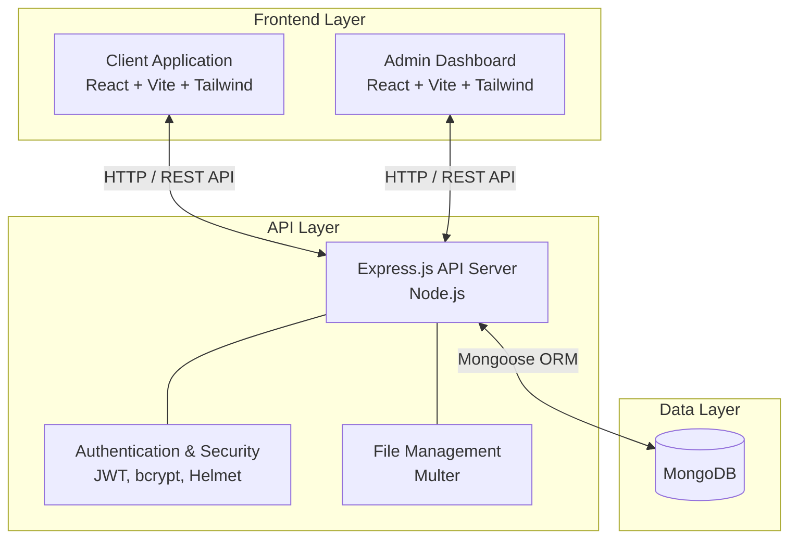

# AryoPath

## Project Description
AryoPath is a modern full-stack web application built using a modernized MERN stack (MongoDB, Express.js, React, Node.js). The project is architected into three distinct workspaces to separate concerns, enforce security, and provide a scalable foundation:

- **Client (`/client`)**: A user-facing frontend application optimized for speed and a modern UI/UX.
- **Admin (`/admin`)**: A dedicated, secure dashboard for platform administrators to manage the application's data.
- **Backend (`/backend`)**: A robust RESTful API server that acts as the central brain, handling business logic, secure authentication, and database operations.

## High-Level Design (HLD)

The application follows a standard Client-Server architecture with a strongly decoupled frontend and backend. 

### 1. Frontend Layer (`client` & `admin`)
*   **Technology Stack**: React 19, Vite, Tailwind CSS v4, React Router DOM.
*   **Responsibilities**: 
    *   Rendering responsive, dynamic, and interactive user interfaces.
    *   Managing client-side routing and state.
    *   Communicating with the backend API via `axios`.
*   **Architectural Choice**: Splitting the frontend into `client` and `admin` ensures that regular users do not download heavy administrative code or logic, keeping the user-facing application lightweight and secure.

### 2. Backend API Layer (`backend`)
*   **Technology Stack**: Node.js, Express.js (v5).
*   **Responsibilities**: 
    *   Exposing a secure RESTful API consumed by both the Client and Admin frontends.
    *   Handling user identity, authentication, and authorization using JSON Web Tokens (JWT) and `bcrypt`.
    *   Processing multipart form data (like images or documents) using `multer`.
    *   Enforcing API security and preventing abuse using `helmet`, `cors`, and `express-rate-limit`.

### 3. Data Layer
*   **Technology Stack**: MongoDB (Document Database) integrated via `mongoose`.
*   **Responsibilities**: 
    *   Persistently storing application entities (e.g., Users, Roles, Content).
    *   Providing a strictly typed schema validation layer before data hits the raw database via Mongoose models.
