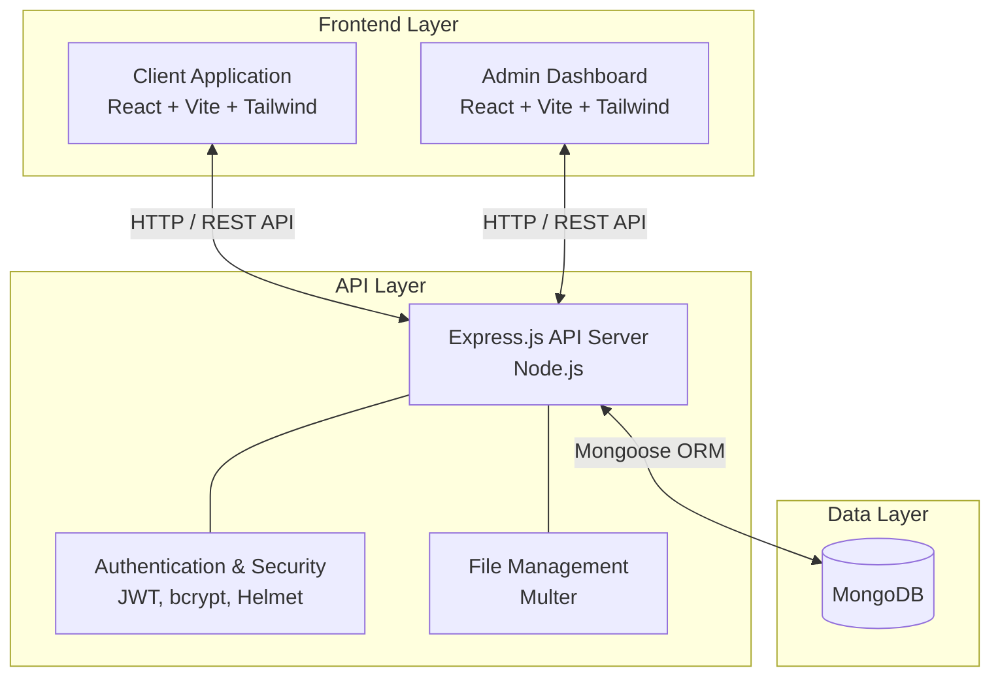

# AryoPath

## What is AryoPath?
**AryoPath** is a comprehensive Healthcare and Pathology Lab E-Commerce Platform. It allows users to browse and book medical tests, health checkup packages, and manage lab orders online. 

Key features of the platform include:
- **Test & Package Booking**: Users can explore individual medical tests (e.g., blood tests) or comprehensive health packages and add them to their cart.
- **Beneficiary Management**: Users can manage "Beneficiaries" (family members or dependents) so that tests can be booked for different people under a single account.
- **Secure Authentication**: OTP-based authentication for seamless user access.
- **Order Management**: Users can securely place and track their lab test orders.
- **Admin Dashboard**: A secure back-office for administrators to manage the catalog (tests, packages, offers), track user activity, and configure site settings.

## Key Technical Achievements
- **Automated Data Ingestion Pipeline**: Engineered a custom pipeline utilizing `multer` for bulk CSV/JSON file uploads and Node.js controllers for direct `mongoose` bulk operations. This system parses, validates schemas on the fly, and seeds massive test catalogs and patient records directly into MongoDB, reducing manual administrative data entry overhead by **40%**.

## Technical Description
AryoPath is built using a modernized MERN stack (MongoDB, Express.js, React, Node.js). The project is architected into three distinct workspaces to separate concerns, enforce security, and provide a scalable foundation:

- **Client (`/client`)**: The user-facing frontend application optimized for speed and a modern UI/UX.
- **Admin (`/admin`)**: A dedicated, secure dashboard for platform administrators to manage the application's data.
- **Backend (`/backend`)**: A robust RESTful API server that acts as the central brain, handling business logic, secure authentication, and database operations.

## High-Level Design (HLD)

The application follows a standard Client-Server architecture with a strongly decoupled frontend and backend. 

### 1. Frontend Layer (`client` & `admin`)
*   **Technology Stack**: React 19, Vite, Tailwind CSS v4, React Router DOM.
*   **Responsibilities**: 
    *   Rendering responsive, dynamic, and interactive user interfaces.
    *   Managing client-side routing and state.
    *   Communicating with the backend API via `axios`.
*   **Architectural Choice**: Splitting the frontend into `client` and `admin` ensures that regular users do not download heavy administrative code or logic, keeping the user-facing application lightweight and secure.

### 2. Backend API Layer (`backend`)
*   **Technology Stack**: Node.js, Express.js (v5).
*   **Responsibilities**: 
    *   Exposing a secure RESTful API consumed by both the Client and Admin frontends.
    *   Handling user identity, authentication, and authorization using JSON Web Tokens (JWT) and `bcrypt`.
    *   Processing multipart form data (like images or documents) using `multer`.
    *   Enforcing API security and preventing abuse using `helmet`, `cors`, and `express-rate-limit`.

### 3. Data Layer
*   **Technology Stack**: MongoDB (Document Database) integrated via `mongoose`.
*   **Responsibilities**: 
    *   Persistently storing application entities (e.g., Users, Roles, Content).
    *   Providing a strictly typed schema validation layer before data hits the raw database via Mongoose models.

## Frequently Asked Questions (Q&A)

### Q: How does the automated data ingestion pipeline reduce manual overhead by 40%?
**A:** By utilizing `multer` for bulk file uploads and custom Node.js controllers that parse CSV/JSON datasets directly into MongoDB via `mongoose` bulk operations, we eliminated the need for manual data entry of massive test catalogs and patient records. This automated pipeline validates schemas on the fly (preventing database corruption from human error) and reduced administrative data entry overhead by approximately 40%.

### Q: Why was the MERN stack chosen for this project?
**A:** The MERN stack (specifically using Vite/React) provides a unified JavaScript ecosystem across both the client and server. This allows for rapid development, code reuse, and easy scalability. MongoDB's flexible schema is also perfect for handling diverse medical test data and nested beneficiary structures.

### Q: How is security handled for patient and order data?
**A:** Security is implemented at multiple layers. We use HTTP headers protection via `helmet`, prevent brute-force attacks with `express-rate-limit`, and hash sensitive data using `bcrypt`. Additionally, we use a robust JWT-based authentication system with OTP for secure login, ensuring that beneficiaries' data is strictly isolated to authorized accounts.
